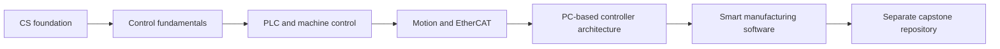

# Industrial Controls Learning Lab

A fundamentals-first, open-source learning lab for software engineers preparing for entry-level roles in:

- automatic control engineering
- PC-based motion-controller software
- smart manufacturing software engineering

The lab assumes a computer-science background. It focuses on the concepts that are difficult to learn casually on the job: physical-system thinking, feedback, machine state, industrial motion, cyclic execution, diagnostics, and manufacturing data. Advanced control and production-hardware topics are marked as follow-on learning.

> [!IMPORTANT]
> This repository is simulation-first and educational. It is not a safety controller, a certified motion controller, or production-ready machine software. Never connect these examples directly to machinery without a formal risk assessment, independent safety functions, qualified engineering review, and the current vendor documentation.

## Start here

1. Read the [role map](docs/01-role-map.md) to understand what each target job expects.
2. Follow the [18-week learning path](docs/00-learning-path.md).
3. Use the [weekly routine](docs/02-weekly-routine.md) and update the [progress tracker](progress/progress-tracker.md).
4. Run the small Python labs and read the matching lab guides.
5. Publish evidence using the [portfolio guide](docs/03-portfolio-evidence.md).
6. After the learning gates are complete, start the capstone in its own repository using the [capstone handoff](docs/07-future-capstone-handoff.md).

## Learning path

| Phase | Weeks | Outcome |
| --- | ---: | --- |
| CS-to-controls bridge | 0 | Explain the complete control and manufacturing stack |
| Control fundamentals | 1–3 | Model and tune a simulated closed-loop axis |
| PLC and machine control | 4–6 | Build explicit states, interlocks, alarms, and recovery |
| Motion and industrial networks | 7–10 | Understand EtherCAT, CiA 402, profiles, homing, and XY sequencing |
| PC-based controller software | 11–13 | Design cyclic, testable controller software with timing evidence |
| Smart manufacturing software | 14–17 | Build telemetry, traceability, SQL, OEE, and API foundations |
| Separate capstone repository | after Week 17 | Integrate the stack into a long-lived open-source project |



## Runnable mini-labs

Requirements: Python 3.11 or newer.

```bash
python -m venv .venv
source .venv/bin/activate              # Windows PowerShell: .venv\Scripts\Activate.ps1
python -m pip install --upgrade pip
python -m pip install -e ".[dev]"
python -m industrial_controls_lab list
python -m industrial_controls_lab run pid
pytest
```

Included lab code:

- first-order plant simulation and response metrics
- discrete PID with output limits and anti-windup
- equipment state machine and motion-permission logic
- CiA 402-inspired drive-state exercise
- acceleration- and velocity-limited position profile
- cyclic-loop jitter measurement
- OEE calculation and simple part-event traceability

The examples are intentionally small. Learners should change parameters, inject failures, add assertions, and document observations rather than treat the output as a finished solution.

## Repository map

```text
.
├── modules/                    # Learning modules and outcomes
├── weekly/                     # Week-by-week study pages
├── labs/                       # Lab instructions and expected evidence
├── src/industrial_controls_lab # Runnable, vendor-neutral Python examples
├── examples/structured-text/   # IEC 61131-3-style examples
├── tests/                      # Automated tests for the learning code
├── docs/                       # Role map, diagrams, references, safety, portfolio guidance
├── progress/                   # Learner-owned progress tracking
├── templates/                  # Notes, experiments, issues, and interview stories
└── .github/                    # CI, issue forms, contribution automation
```

## Core diagrams

- [Industrial control stack](docs/diagrams/industrial-control-stack.md)
- [Learning dependency map](docs/diagrams/learning-dependency-map.md)
- [Equipment state machine](docs/diagrams/equipment-state-machine.md)
- [Axis troubleshooting flow](docs/diagrams/axis-troubleshooting-flow.md)
- [Manufacturing data flow](docs/diagrams/manufacturing-data-flow.md)

## Scope of the future capstone

The capstone is deliberately not implemented here. It should grow as a separate repository with its own releases, roadmap, maintainers, issue tracker, architecture decisions, and hardware adapters. This learning lab supplies the prerequisite knowledge and reusable experiments.

Suggested future repository name:

```text
virtual-smart-motion-cell
```

Until that repository exists, keep `CAPSTONE_REPOSITORY_URL` as a placeholder in [the handoff document](docs/07-future-capstone-handoff.md).

## Contributing

Contributions can be code, diagrams, experiments, clearer explanations, tests, translations, accessibility improvements, or corrections. Start with [CONTRIBUTING.md](CONTRIBUTING.md), follow the [Code of Conduct](CODE_OF_CONDUCT.md), and respect the [safety boundary](docs/04-safety-boundary.md).

Good first contributions are labeled in the issue tracker. Larger curriculum or architecture changes should begin with a proposal issue.

## Open-source project files

This repository includes:

- Apache License 2.0 and NOTICE
- Contributor Covenant 2.1
- contributing, governance, security, support, and maintenance policies
- issue forms and a pull-request template
- CI across supported Python versions
- dependency update configuration
- citation metadata and changelog
- a [publishing checklist](docs/08-publishing-checklist.md) and local Git bootstrap script

Before publishing, replace the maintainer and security-contact placeholders listed in [MAINTAINERS.md](MAINTAINERS.md).

## License and trademarks

Code and documentation are licensed under the [Apache License 2.0](LICENSE), unless a file states otherwise. Company and product names are used only for educational reference. Beckhoff, TwinCAT, EtherCAT, PLCopen, OPC UA, and other marks belong to their respective owners. This project is not affiliated with or endorsed by those organizations.
