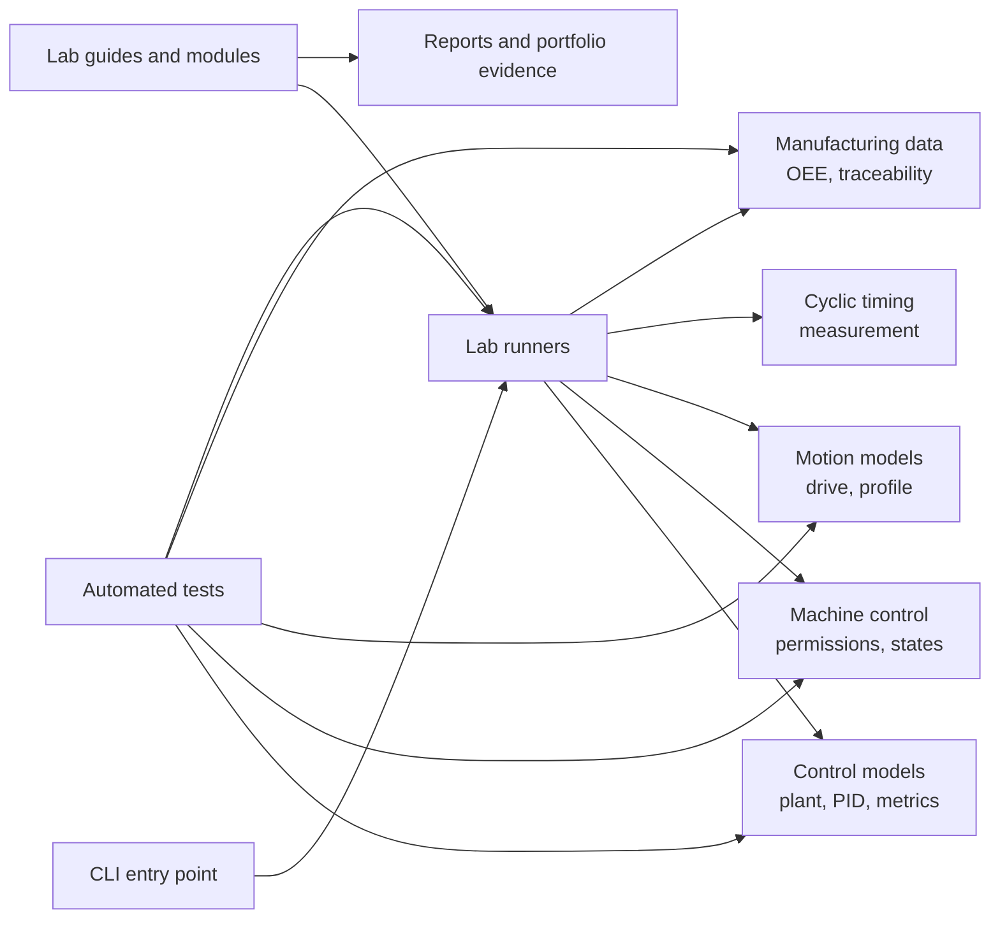

# Industrial Controls Learning Lab

[](https://github.com/parthoece/industrial-controls-learning-lab/actions/workflows/ci.yml)

[](LICENSE)

A simulation-first, open-source learning environment for software engineers building foundations in control systems, PLC and machine control, industrial motion, PC-based controller software, and smart manufacturing.

The project bridges a computer-science background to entry-level work in:

* automatic control engineering
* PC-based motion-controller software
* PLC and machine-control programming
* industrial automation and diagnostics
* smart manufacturing software engineering

It emphasizes concepts that are difficult to learn casually on the job: physical-system thinking, feedback, explicit machine state, industrial motion, cyclic execution, fault diagnosis, traceability, and manufacturing data.

> [!IMPORTANT]
> This repository is educational and simulation-first. It is **not** a safety controller, certified motion controller, or production-ready machine-control system.
>
> Do not connect these examples directly to machinery without a formal risk assessment, independent safety functions, qualified engineering review, controlled commissioning, and current vendor documentation.

## Project status

Industrial Controls Learning Lab is an **alpha-stage educational project**.

| Area                   | Current status                                     |
| ---------------------- | -------------------------------------------------- |
| Package version        | `0.1.0` development snapshot                       |
| Public release         | First tagged release pending                       |
| Python requirement     | Python 3.11 or newer                               |
| CI-tested environment  | Ubuntu with Python 3.11, 3.12, and 3.13            |
| Runnable labs          | Six command-line simulation labs                   |
| Runtime dependencies   | None                                               |
| Development dependency | `pytest`                                           |
| Hardware required      | No                                                 |
| Hardware validated     | No                                                 |
| Real-time guarantee    | None                                               |
| Public Python API      | Experimental; subject to change before version 1.0 |
| License                | Apache License 2.0                                 |

## Why this project exists

Industrial-control software sits at the intersection of software, electronics, mechanics, networking, and manufacturing operations. Developers entering this field must reason about more than data and application state:

* timing can be part of correctness
* units and coordinate systems are part of an interface contract
* commands can be accepted without producing the intended physical result
* faults are expected operating states
* feedback can be delayed, noisy, stale, or incorrect
* software outputs may ultimately command hazardous energy

This repository provides a small, vendor-neutral environment for learning those ideas before moving to production hardware, vendor toolchains, or advanced control topics.

## What is implemented today

| Capability                    | Runnable baseline |            Automated checks            | Status and limitations                                   |
| ----------------------------- | :---------------: | :------------------------------------: | -------------------------------------------------------- |
| First-order plant simulation  |        Yes        |            Plant convergence           | Explicit Euler educational model                         |
| Discrete PID control          |        Yes        | Setpoint tracking and input validation | Includes output limits and conditional anti-windup       |
| Error metrics                 |        Yes        |         Invalid-length handling        | RMS, maximum absolute, and final error                   |
| Motion-permission logic       |        Yes        |     First failed permission reason     | Standard simulated control logic, not functional safety  |
| Equipment state machine       |        Yes        |  Fault reset without automatic restart | Small explicit state and recovery model                  |
| CiA 402-inspired drive states |        Yes        |       Fault-clear reset sequence       | Concept exercise, not a complete CiA 402 implementation  |
| Trapezoidal position profile  |        Yes        |            Target completion           | Incremental velocity- and acceleration-limited reference |
| Cyclic timing observation     |        Yes        |          CLI runner execution          | Host-dependent measurement; no hard real-time claim      |
| OEE calculation               |        Yes        |    Expected factor and total values    | Uses explicit production assumptions                     |
| Part-event traceability       |        Yes        |  Duplicate-event rejection and history | In-memory educational event store                        |
| Structured Text examples      |       No CLI      |           Not compiled in CI           | IEC 61131-3-style, vendor-neutral templates              |

The curriculum covers additional topics—such as EtherCAT diagnostics, homing, soft limits, bounded queues, OPC UA, MQTT, REST, SQL modeling, and outage behavior—as guided learning and design work. These topics should not be interpreted as complete protocol stacks or production integrations.

## Quick start

### Requirements

* Python 3.11 or newer
* Git
* a terminal or PowerShell session

The package is installed from source. It is not currently presented as a production package or hardware-control library.

### Linux or macOS

```bash
git clone https://github.com/parthoece/industrial-controls-learning-lab.git
cd industrial-controls-learning-lab

python3 -m venv .venv
source .venv/bin/activate

python -m pip install --upgrade pip
python -m pip install -e ".[dev]"
```

### Windows PowerShell

```powershell
git clone https://github.com/parthoece/industrial-controls-learning-lab.git
Set-Location industrial-controls-learning-lab

python -m venv .venv
.venv\Scripts\Activate.ps1

python -m pip install --upgrade pip
python -m pip install -e ".[dev]"
```

### Verify the installation

```bash
python -m industrial_controls_lab list
pytest
```

The installed console command is also available:

```bash
industrial-controls-lab list
```

## One-minute demonstration

List the available labs:

```console
$ industrial-controls-lab list
plant
pid
machine
motion
timing
manufacturing
```

Run the machine-state exercise:

```console
$ industrial-controls-lab run machine
{
  "enabled": true,
  "final_state": "IDLE",
  "reset_after_clear": true,
  "reset_before_clear": false,
  "started": true
}
```

The example starts the simulated equipment, injects a guard-open condition, verifies that reset is rejected while the cause remains active, clears the cause, and returns to `IDLE` without automatically restarting.

Run any other lab with:

```bash
industrial-controls-lab run plant
industrial-controls-lab run pid
industrial-controls-lab run motion
industrial-controls-lab run timing
industrial-controls-lab run manufacturing
```

Timing results vary by operating system, workload, hardware, and scheduler. They are observations from a general-purpose operating system, not evidence of deterministic or hard real-time execution.

## Learning model

Each lab has three layers:

1. **Guided baseline** — run and inspect the included implementation.
2. **Controlled modification** — change one parameter, assumption, or failure condition.
3. **Evidence** — explain the result using measurements, tests, and stated limitations.

A complete exercise should include:

* the engineering question
* assumptions and units
* sample time or timing conditions
* a normal case
* a boundary case
* a failure or diagnostic case
* measurable results
* interpretation and limitations
* a reproduction command

Use the [experiment report template](templates/experiment-report.md) to document the work.

## Start here

1. Read the [role map](docs/01-role-map.md) to understand the target job families.
2. Review the [18-week learning path](docs/00-learning-path.md).
3. Follow the [weekly routine](docs/02-weekly-routine.md).
4. Run the [six guided labs](labs/README.md).
5. Track work using the [progress tracker](progress/progress-tracker.md).
6. Publish selected results using the [portfolio evidence guide](docs/03-portfolio-evidence.md).
7. Begin the separate capstone only after completing the documented learning gates.

## Learning path

| Phase                          |         Weeks | Primary outcome                                                                 |
| ------------------------------ | ------------: | ------------------------------------------------------------------------------- |
| CS-to-controls bridge          |             0 | Explain the industrial control and manufacturing software stack                 |
| Control fundamentals           |           1–3 | Model and tune a simulated closed-loop axis                                     |
| PLC and machine control        |           4–6 | Build explicit states, interlocks, alarms, and recovery behavior                |
| Motion and industrial networks |          7–10 | Understand drive states, motion profiles, homing, limits, and EtherCAT concepts |
| PC-based controller software   |         11–13 | Design cyclic and testable controller software with timing evidence             |
| Smart manufacturing software   |         14–17 | Build telemetry, traceability, SQL, OEE, and API foundations                    |
| Independent capstone           | After Week 17 | Integrate the stack in a separately maintained project                          |

The learning gates matter more than calendar speed. Learners should proceed when they can explain, test, and diagnose the required behavior—not merely after reading the material.

## Software architecture

The implementation is intentionally small. It separates the command-line interface from domain examples so each concept can be inspected and tested independently.



### Architectural rules

* Domain examples do not depend on the CLI.
* Units, timing assumptions, and model limitations should be explicit.
* Machine commands, state, status, faults, and diagnostics should remain distinguishable.
* Simulation behavior must not be described as hardware validation.
* Timing measurements from a general-purpose operating system must not be presented as real-time guarantees.
* Ordinary interlocks and permission logic must not be described as functional safety.
* Future hardware adapters should remain outside the core learning models unless their interfaces and safety boundaries are explicit.

## Runnable labs

| Lab                            | Command             | Main concepts                                 | Evidence requested                                               |
| ------------------------------ | ------------------- | --------------------------------------------- | ---------------------------------------------------------------- |
| First-order plant              | `run plant`         | gain, time constant, sampling, disturbance    | final value, response time, units, numerical limitations         |
| PID and anti-windup            | `run pid`           | P/PI/PID, saturation, derivative, sample time | rise time, overshoot, settling, RMS error, saturation duration   |
| Equipment state and interlocks | `run machine`       | permission reasons, state, faults, reset      | state diagram, transition table, fault and rejection reasons     |
| Motion profile and drive state | `run motion`        | drive state, velocity and acceleration limits | profile duration, peak velocity, target error, drive transitions |
| Cyclic timing                  | `run timing`        | deadlines, intervals, jitter, overruns        | min/mean/max interval, standard deviation, platform              |
| OEE and traceability           | `run manufacturing` | OEE assumptions, idempotency, event history   | formula inputs, duplicate policy, reconstructed part history     |

See [`labs/README.md`](labs/README.md) for the full guides.

## Structured Text examples

The repository also includes IEC 61131-3-style Structured Text examples for:

* explicit equipment-state enumeration
* observable motion-block reasons
* first-failure motion-permission evaluation
* command, state, fault, and reset separation

These examples avoid vendor-library calls where practical. They are educational templates and are not compiled or validated against a specific PLC runtime in CI.

Before adapting them to a PLC platform, review:

* type and enumeration syntax
* edge detection
* task and scan timing
* vendor library conventions
* diagnostics
* startup and retentive behavior
* safety separation

## Quality and validation

Run the complete local project check:

```bash
make check
```

The equivalent cross-platform commands are:

```bash
python -m compileall -q src tests scripts
pytest
python scripts/check_repo.py
```

Continuous integration currently:

* installs the project on Ubuntu
* tests Python 3.11, 3.12, and 3.13
* compiles source, tests, and scripts
* runs the automated test suite
* verifies required project files and relative Markdown links
* rejects tracked cache and virtual-environment directories
* smoke-runs representative command-line labs

Behavior changes should include normal and failure-oriented tests where practical. Documentation and learning contributions should state assumptions, units, timing, and whether work is simulated, pseudocode, or hardware-tested.

## Repository structure

```text
.
├── modules/                     # Topic modules and required outcomes
├── weekly/                      # Week-by-week study pages
├── labs/                        # Runnable lab guides and evidence requirements
├── src/
│   └── industrial_controls_lab/ # Vendor-neutral Python package
├── examples/
│   └── structured-text/         # IEC 61131-3-style examples
├── tests/                       # Automated tests
├── docs/                        # Maps, diagrams, references, safety, and policy
├── progress/                    # Reusable learner progress tracker
├── templates/                   # Reports, ADRs, notes, and portfolio templates
├── scripts/                     # Repository validation and bootstrap utilities
└── .github/                     # CI, issue forms, PR template, and automation
```

## Documentation

### Learning and role preparation

* [18-week learning path](docs/00-learning-path.md)
* [Role map](docs/01-role-map.md)
* [Weekly learning routine](docs/02-weekly-routine.md)
* [Portfolio evidence guide](docs/03-portfolio-evidence.md)
* [Core glossary](docs/06-glossary.md)

### Engineering boundaries and references

* [Safety and scope boundary](docs/04-safety-boundary.md)
* [Reference policy and starter sources](docs/05-reference-policy.md)
* [Industrial control stack](docs/diagrams/industrial-control-stack.md)
* [Learning dependency map](docs/diagrams/learning-dependency-map.md)
* [Equipment state machine](docs/diagrams/equipment-state-machine.md)
* [Axis troubleshooting flow](docs/diagrams/axis-troubleshooting-flow.md)
* [Manufacturing data flow](docs/diagrams/manufacturing-data-flow.md)

### Project operation

* [Contributing guide](CONTRIBUTING.md)
* [Governance](GOVERNANCE.md)
* [Maintainers](MAINTAINERS.md)
* [Security policy](SECURITY.md)
* [Support policy](SUPPORT.md)
* [Changelog](CHANGELOG.md)
* [Publishing checklist](docs/08-publishing-checklist.md)
* [Citation metadata](CITATION.cff)

## Scope and limitations

### Included

* foundational control-system simulations
* explicit machine-state and diagnostic examples
* introductory motion-profile and drive-state concepts
* cyclic timing observation
* manufacturing metrics and event-traceability examples
* Structured Text learning templates
* automated tests and CI
* curriculum, experiment, and portfolio templates
* open-source contribution and governance files

### Not included

* functional-safety implementation or certification
* production machinery control
* machine risk assessment
* electrical or guarding design
* safety-rated PLC, drive, network, or emergency-stop logic
* a production EtherCAT master
* complete CiA 402 or PLCopen Motion implementations
* hardware commissioning procedures
* deterministic real-time execution
* CNC, robotics, camming, interpolation, or gantry control
* production OPC UA, MQTT, MES, ERP, or cloud infrastructure
* enterprise cybersecurity architecture
* vendor certification or endorsement

Advanced controls, hardware integration, production networking, commissioning, and functional safety are follow-on disciplines requiring qualified engineering and current authoritative documentation.

## Evidence and portfolio use

This repository is intended to produce explainable evidence, not a list of technologies.

Strong evidence includes:

* a control experiment with stated parameters and response metrics
* a state-transition table with invalid-transition tests
* observable motion-permission and fault reasons
* a profile or timing report with platform and sampling details
* a traceability example with duplicate handling
* an OEE calculation with documented assumptions
* a concise explanation of what remains simulation-only

Learners may keep personal evidence in a fork, personal branch, or separate portfolio repository. Do not merge personal claims into the upstream project unless they form part of a reproducible contributed example.

## Contributing

Contributions are welcome from learners, software engineers, controls engineers, educators, technical writers, and manufacturing professionals.

Useful contributions include:

* clearer technical explanations
* terminology and reference corrections
* additional normal, boundary, and failure tests
* reproducible experiments
* diagnostic improvements
* diagrams and accessibility improvements
* vendor-neutral Structured Text examples
* cross-platform setup improvements
* translations
* small lab extensions

Before opening work:

1. Read [CONTRIBUTING.md](CONTRIBUTING.md).
2. Search existing issues and pull requests.
3. Use a proposal issue for substantial curriculum, architecture, public-interface, tooling, or policy changes.
4. Keep beginner material vendor-neutral where practical.
5. Do not submit proprietary code, confidential diagrams, customer data, credentials, licensed vendor projects, or copied safety logic.
6. Follow the [Code of Conduct](CODE_OF_CONDUCT.md).

Pull requests should be focused, include tests or evidence when behavior changes, update relevant documentation, and pass CI.

## Support and security

For learning questions, setup help, and design discussion, follow [SUPPORT.md](SUPPORT.md).

The maintainers cannot provide:

* emergency response
* machine commissioning
* production-incident support
* safety certification
* product-specific guarantees

Do not disclose vulnerabilities, exposed credentials, hazardous operational behavior, or unsafe motion instructions in a public issue. Follow [SECURITY.md](SECURITY.md) for private reporting.

## Releases and compatibility

The package metadata currently uses version `0.1.0`, while the first tagged public release is still pending.

Before version 1.0:

* Python interfaces may change
* CLI result fields may change
* curriculum structure may evolve
* examples may be expanded or corrected
* changes affecting users should be recorded in [CHANGELOG.md](CHANGELOG.md)

Use a tagged release or commit identifier when citing or reproducing results.

## Future capstone

The final integrated project is deliberately outside this repository.

The proposed capstone, `virtual-smart-motion-cell`, should combine:

* closed-loop axis simulation
* motion profiles, homing, limits, and coordinate validity
* machine modes, interlocks, alarms, and recovery
* drive-state and network-health abstractions
* a deterministic cyclic-controller core
* telemetry, traceability, recipes, and cycle records
* OEE with documented assumptions
* a small read-only API or operator interface
* unit, integration, fault-injection, and acceptance tests

It should have its own releases, roadmap, maintainers, architecture decisions, issue tracker, CI, and hardware-adapter interfaces.

See the [future capstone handoff](docs/07-future-capstone-handoff.md).

## Citation

Citation metadata is provided in [`CITATION.cff`](CITATION.cff).

When referencing the project, cite the tagged release or commit used so that the implementation and curriculum state can be reproduced.

## License

Code and documentation are licensed under the [Apache License 2.0](LICENSE), unless an individual file states otherwise.

See [NOTICE](NOTICE) for attribution information.

## Trademarks and affiliations

Company, organization, protocol, and product names are used only for educational and descriptive purposes.

Beckhoff, TwinCAT, EtherCAT, PLCopen, OPC UA, and other names or marks referenced by this project belong to their respective owners.

This project is independent and is not affiliated with, sponsored by, certified by, or endorsed by those organizations.
