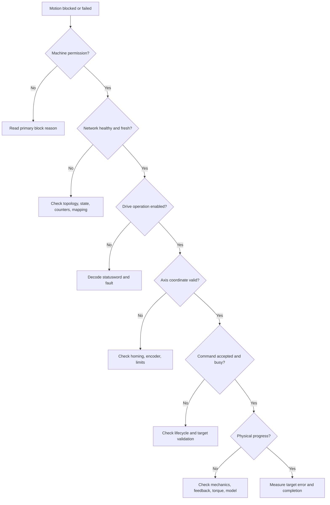

# Axis troubleshooting flow

```mermaid
flowchart TD
    A[Motion blocked or failed] --> P{Machine permission?}
    P -- No --> PR[Read primary block reason]
    P -- Yes --> N{Network healthy and fresh?}
    N -- No --> ND[Check topology, state, counters, mapping]
    N -- Yes --> D{Drive operation enabled?}
    D -- No --> DD[Decode statusword and fault]
    D -- Yes --> X{Axis coordinate valid?}
    X -- No --> XD[Check homing, encoder, limits]
    X -- Yes --> C{Command accepted and busy?}
    C -- No --> CD[Check lifecycle and target validation]
    C -- Yes --> M{Physical progress?}
    M -- No --> MD[Check mechanics, feedback, torque, model]
    M -- Yes --> E[Measure target error and completion]
```
