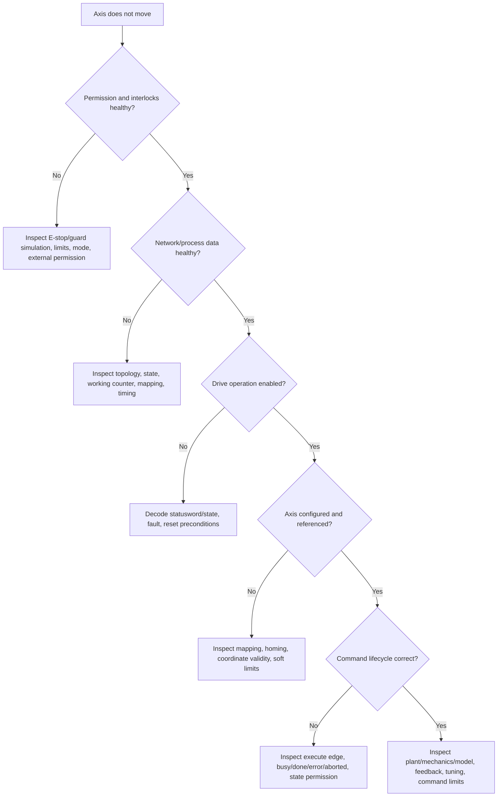

# Axis Troubleshooting Flow

```mermaid
flowchart TD
    A[Axis does not move] --> B{Permission and interlocks healthy?}
    B -- No --> B1[Inspect E-stop/guard simulation, limits, mode, external permission]
    B -- Yes --> C{Network/process data healthy?}
    C -- No --> C1[Inspect topology, state, working counter, mapping, timing]
    C -- Yes --> D{Drive operation enabled?}
    D -- No --> D1[Decode statusword/state, fault, reset preconditions]
    D -- Yes --> E{Axis configured and referenced?}
    E -- No --> E1[Inspect mapping, homing, coordinate validity, soft limits]
    E -- Yes --> F{Command lifecycle correct?}
    F -- No --> F1[Inspect execute edge, busy/done/error/aborted, state permission]
    F -- Yes --> G[Inspect plant/mechanics/model, feedback, tuning, command limits]
```

Use a layered order rather than changing random PLC variables. Record the first failed layer and the evidence used to reach that conclusion.
