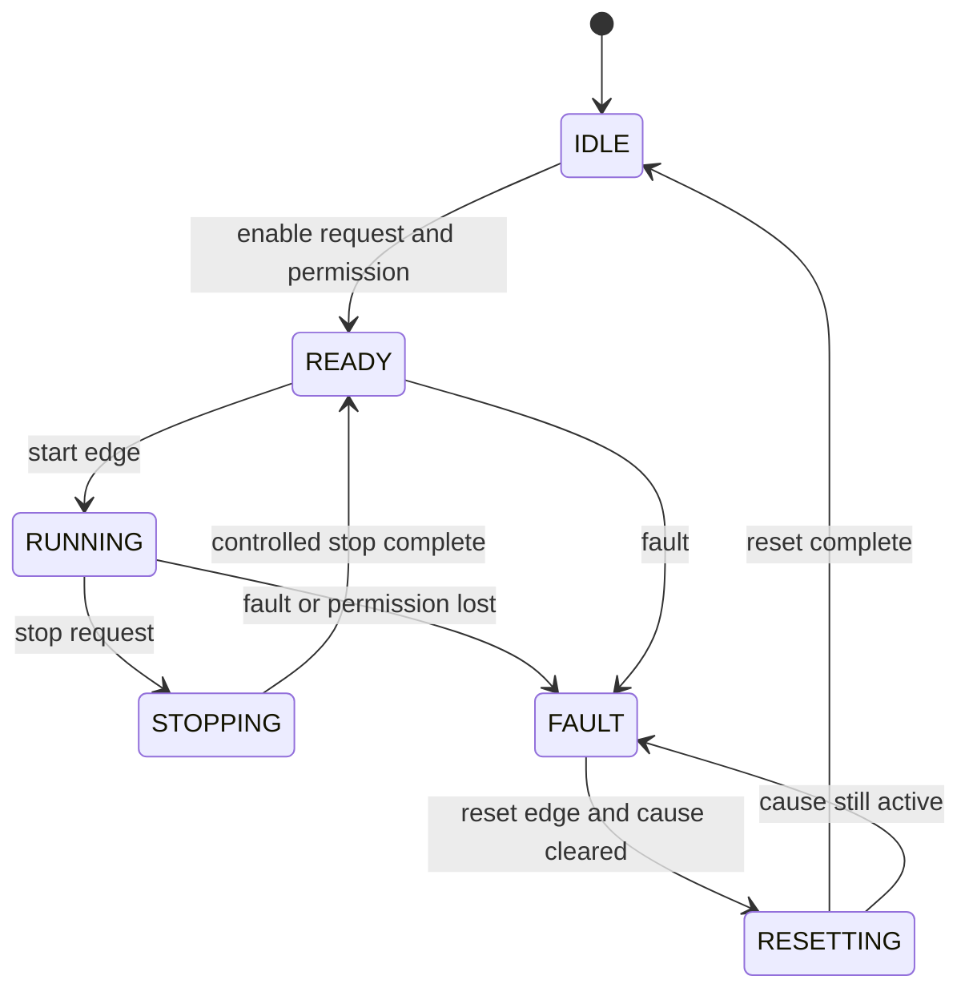

# Equipment State Machine

Important properties:

- clearing a fault does not automatically restart motion
- commands are edges or explicitly acknowledged requests
- each blocked transition has an observable reason
- the state machine is separate from functional-safety logic
