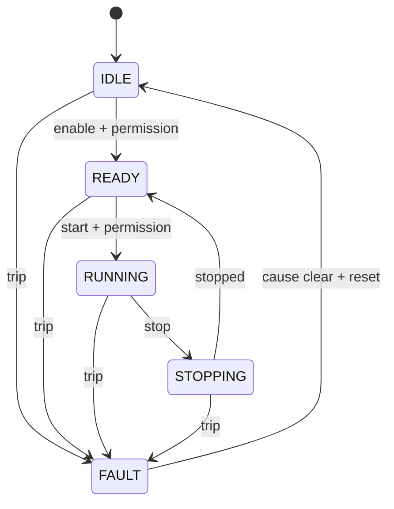

# Equipment state machine

```mermaid
stateDiagram-v2
    [*] --> IDLE
    IDLE --> READY: enable + permission
    READY --> RUNNING: start + permission
    RUNNING --> STOPPING: stop
    STOPPING --> READY: stopped
    IDLE --> FAULT: trip
    READY --> FAULT: trip
    RUNNING --> FAULT: trip
    STOPPING --> FAULT: trip
    FAULT --> IDLE: cause clear + reset
```
