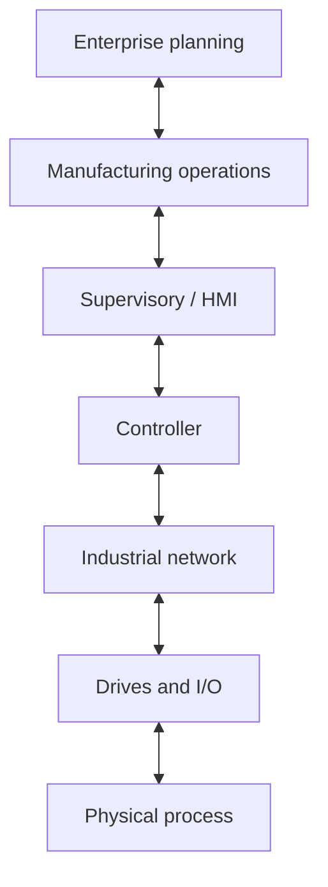

# Industrial control stack

```mermaid
flowchart TB
    ERP[Enterprise planning]
    MES[Manufacturing operations]
    HMI[Supervisory / HMI]
    CTRL[Controller]
    NET[Industrial network]
    IO[Drives and I/O]
    PLANT[Physical process]
    ERP <--> MES
    MES <--> HMI
    HMI <--> CTRL
    CTRL <--> NET
    NET <--> IO
    IO <--> PLANT
```
