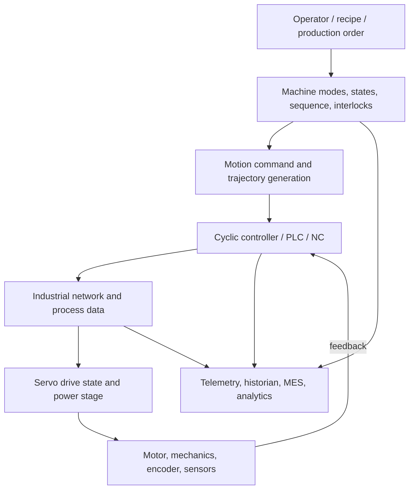

# Industrial Control Stack

A command can be valid in application software and still fail to produce motion because a lower layer is unhealthy. Diagnostics should preserve visibility across all layers.
