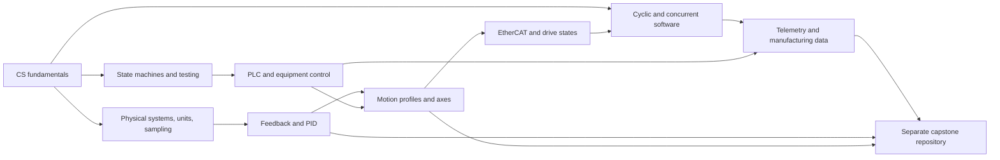

# Learning Dependency Map

```mermaid
flowchart LR
    CS[CS fundamentals] --> SYS[Physical systems, units, sampling]
    SYS --> CTRL[Feedback and PID]
    CS --> SM[State machines and testing]
    SM --> PLC[PLC and equipment control]
    CTRL --> MOTION[Motion profiles and axes]
    PLC --> MOTION
    MOTION --> NET[EtherCAT and drive states]
    CS --> RT[Cyclic and concurrent software]
    NET --> RT
    RT --> DATA[Telemetry and manufacturing data]
    PLC --> DATA
    DATA --> CAP[Separate capstone repository]
    CTRL --> CAP
    MOTION --> CAP
```

The dependencies are directional, not absolute. Learners may preview later topics, but the arrows show which ideas should be stable before claiming practical competence.
