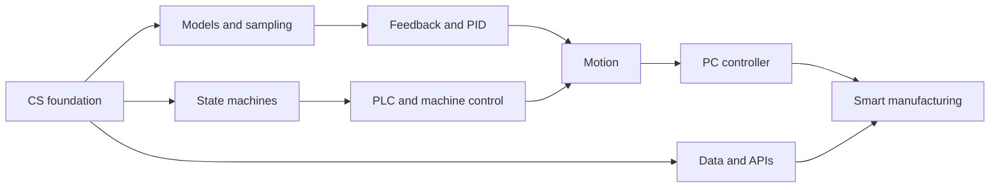

# Learning dependency map

```mermaid
flowchart LR
    CS[CS foundation] --> MODEL[Models and sampling]
    MODEL --> FB[Feedback and PID]
    CS --> STATE[State machines]
    STATE --> PLC[PLC and machine control]
    FB --> MOTION[Motion]
    PLC --> MOTION
    MOTION --> CYCLIC[PC controller]
    CS --> DATA[Data and APIs]
    CYCLIC --> SMART[Smart manufacturing]
    DATA --> SMART
```
