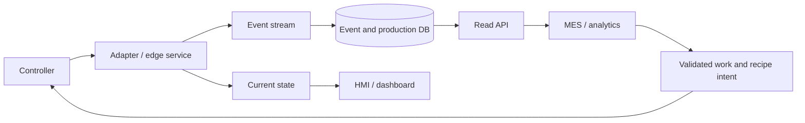

# Manufacturing data flow

```mermaid
flowchart LR
    CTRL[Controller] --> EDGE[Adapter / edge service]
    EDGE --> EVENTS[Event stream]
    EDGE --> STATE[Current state]
    EVENTS --> DB[(Event and production DB)]
    STATE --> HMI[HMI / dashboard]
    DB --> API[Read API]
    API --> MES[MES / analytics]
    MES --> ORDER[Validated work and recipe intent]
    ORDER --> CTRL
```
