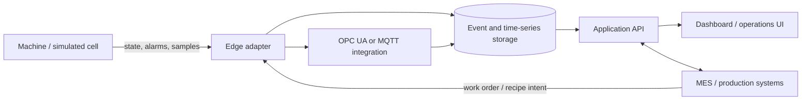

# Manufacturing Data Flow

```mermaid
flowchart LR
    CELL[Machine / simulated cell]
    EDGE[Edge adapter]
    BROKER[OPC UA or MQTT integration]
    STORE[(Event and time-series storage)]
    API[Application API]
    UI[Dashboard / operations UI]
    MES[MES / production systems]

    CELL -->|state, alarms, samples| EDGE
    EDGE --> BROKER
    EDGE --> STORE
    BROKER --> STORE
    STORE --> API
    API --> UI
    API <--> MES
    MES -->|work order / recipe intent| EDGE
```

Commands, events, current state, and measurements should use different contracts. Production intent must be validated at the machine boundary before it becomes motion.
