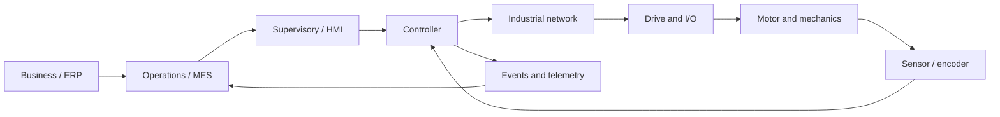

# Week 00 — Industrial Control Stack

> **Guiding question:** How does a software command become physical motion and manufacturing data?

## Learning objectives

- Trace a command from business intent to physical output.
- Separate command, state, status, measurement, event, and alarm.
- Explain why timing and units change software design.
- Identify the safety boundary.

## Key terms

| Term | Working meaning |
| --- | --- |
| **Plant** | Physical or simulated process. |
| **Controller** | Computes a command from desired and measured behavior. |
| **Command** | Request to perform an action. |
| **Status** | Current reported condition. |
| **Measurement** | Observed value from sensor or model. |
| **Event** | Immutable record that something happened. |
| **Alarm** | Abnormal condition requiring attention. |
| **Interlock** | Condition that blocks an operation. |
| **Functional safety** | Validated risk-reduction system; not ordinary control logic. |

## Mental model

## Stack layers

| Layer | Typical responsibility | Time scale |
| --- | --- | --- |
| Physical process | motion, force, temperature, flow | microseconds to hours |
| Field devices | sensors, drives, valves, I/O | microseconds to milliseconds |
| Control | cyclic logic, feedback, interlocks | sub-millisecond to seconds |
| Supervisory | HMI, alarms, recipes, trends | seconds to minutes |
| Operations | work orders, quality, genealogy | minutes to days |
| Enterprise | planning, finance, supply chain | hours to months |

## Command is not result

A command can be:

- rejected before execution
- accepted but not started
- started but still busy
- completed successfully
- completed with poor physical result
- aborted by an interlock
- failed because feedback is invalid

Track command lifecycle and physical outcome separately.

## Physical-system rules

- Energy may remain after software stops.
- Sensors can be wrong.
- Mechanics can jam.
- Communication can be stale.
- A valid data type can hold an invalid engineering value.
- A fast average does not prove a bounded deadline.
- A software permission is not a safety function.

## Useful software split

Keep separate objects or fields for:

- `command`
- `mode`
- `state`
- `status`
- `measurement`
- `fault`
- `diagnostic_reason`
- `event`

This makes failures observable.

## Worked example

A work order requests part `P-104`.

1. Operations selects recipe `R-7`.
2. HMI requests automatic start.
3. Controller checks mode and permissions.
4. Axis command enters `Busy`.
5. Drive reports operation enabled.
6. Encoder position changes.
7. Controller declares target reached.
8. A completion event records part, recipe, time, and result.

Possible mismatch: step 4 succeeds, but step 6 never changes. The command lifecycle is healthy; the physical path is not.

## Common mistakes

- Treating a command bit as proof of motion.
- Using one Boolean called `fault` for every failure.
- Mixing business logic into a cyclic control update.
- Calling simulated guard logic functional safety.

## Practice

1. Draw the stack for a conveyor with barcode scanner.
2. List three failures between command and physical result.
3. For each failure, name one observable diagnostic.

## Practical lab

No code lab. Create the stack diagram and update the glossary.

## Knowledge checks

1. **Why is a command not proof of physical motion?**

   

Answer

   The command can be rejected, delayed, aborted, or executed while the actuator or feedback path fails.

   

2. **What belongs in an API contract besides data type?**

   

Answer

   Units, coordinate frame, valid range, timing, freshness, and state assumptions.

   

3. **Why are faults normal states?**

   

Answer

   Industrial equipment must detect, report, stop, and recover from expected abnormal conditions.

   

4. **What is the safety boundary?**

   

Answer

   Educational interlocks may model blocking behavior, but validated safety functions require independent safety engineering and certified components.

   

## Deep study

- [NIST SP 800-82 Rev. 3](https://csrc.nist.gov/pubs/sp/800/82/r3/final) — Read the OT overview and system-topology sections.
- [MIT Feedback Systems](https://ocw.mit.edu/courses/6-302-feedback-systems-spring-2007/) — Preview how feedback connects models, measurements, and physical systems.

## Exit criteria

Move on when you can:

- explain the guiding question without notes
- reproduce the worked example
- pass the knowledge checks
- complete the linked evidence
- state one limitation of the model
