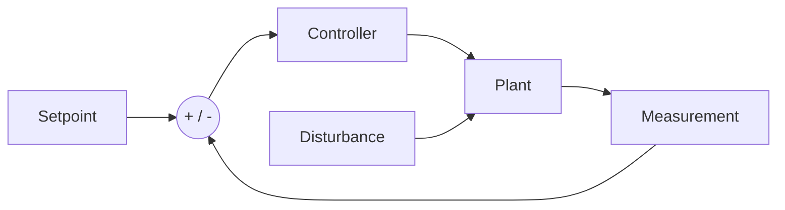

# Week 02 — Feedback and Response Metrics

> **Guiding question:** How does feedback reject disturbances, and how is behavior measured?

## Learning objectives

- Draw a closed-loop system.
- Explain error and disturbance rejection.
- Measure rise time, overshoot, settling, and steady-state error.
- Separate stability intuition from proof.

## Key terms

| Term | Working meaning |
| --- | --- |
| **Setpoint** | Desired controlled value. |
| **Error** | Setpoint minus measurement. |
| **Feedback** | Use of measured output to change command. |
| **Disturbance** | Unrequested influence on the plant. |
| **Rise time** | Time to move through a defined fraction of the step. |
| **Overshoot** | Peak amount above target. |
| **Settling time** | Time after which response stays within a tolerance. |
| **Steady-state error** | Remaining long-term error. |

## Mental model

## Open loop

Command does not change when output changes.

Strengths:

- simple
- no sensor required

Weaknesses:

- poor disturbance rejection
- model error directly affects result

## Closed loop

Command responds to measured error.

Benefits:

- disturbance rejection
- reduced sensitivity to some plant variation
- measurable tracking

Costs:

- sensor noise enters the loop
- delay can reduce stability
- poor tuning can oscillate

## Core metrics

| Metric | Basic definition | Use |
| --- | --- | --- |
| Rise time | time between selected response levels | speed |
| Overshoot | `(peak-target)/step` | aggressiveness |
| Settling time | time inside tolerance band | recovery |
| Final error | final setpoint minus measurement | tracking |
| RMS error | square-root mean squared error | overall error |

## Stability intuition

Warning signs:

- growing oscillation
- repeated saturation
- response does not settle
- increasing sensitivity to delay

A finite simulation is evidence, not a mathematical stability proof.

## Worked example

A heater target is `80 °C`.

Open loop:

- fixed power command
- room temperature changes
- final temperature shifts

Closed loop:

- controller increases power when temperature falls
- controller reduces power near target

Measure both cases after a `-5 °C` disturbance.

## Common mistakes

- Reporting only final value.
- Using an undefined settling tolerance.
- Calling a noisy trace unstable without checking trend.
- Ignoring actuator limits.

## Practice

1. Define a 2% settling band for a target of 5.0.
2. Calculate 10% overshoot for a unit step.
3. Explain why feedback can amplify sensor noise.

## Practical lab

Extend [Lab 01](../labs/lab-01-first-order-plant.md) or use [Lab 02](../labs/lab-02-pid.md).

## Knowledge checks

1. **Why does feedback reject a disturbance?**

   

Answer

   The disturbance changes measurement, which creates error and changes the controller output.

   

2. **What must be stated with settling time?**

   

Answer

   The tolerance band and the point from which time is measured.

   

3. **What does RMS error hide?**

   

Answer

   It compresses the time history; two responses can have the same RMS error but different overshoot or settling.

   

4. **Does a stable simulation prove real-system stability?**

   

Answer

   No. The model, timestep, delay, nonlinearities, and hardware can differ.

   

## Deep study

- [MIT Feedback Systems](https://ocw.mit.edu/courses/6-302-feedback-systems-spring-2007/) — Study feedback properties and performance measures.
- [Feedback Systems book](https://fbsbook.org/) — Use the chapters on feedback and loop analysis.

## Exit criteria

Move on when you can:

- explain the guiding question without notes
- reproduce the worked example
- pass the knowledge checks
- complete the linked evidence
- state one limitation of the model
