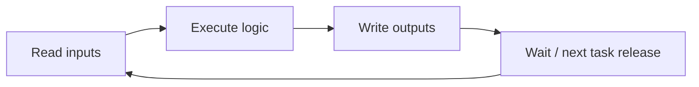

# Week 04 — PLC Scan and Structured Text

> **Guiding question:** How does cyclic PLC execution change program behavior?

## Learning objectives

- Explain input-read, logic-execute, output-write behavior.
- Distinguish functions, function blocks, programs, and data types.
- Read basic Structured Text.
- Explain edge detection and retained state.

## Key terms

| Term | Working meaning |
| --- | --- |
| **Scan** | One cyclic controller execution. |
| **Task** | Scheduled execution context. |
| **Function** | Computation without persistent instance state. |
| **Function block** | Reusable logic with persistent instance state. |
| **Program** | Top-level PLC application unit. |
| **Rising edge** | Transition from false to true. |
| **Retentive data** | Data preserved across defined restart conditions. |

## Mental model



## Scan consequences

Within one scan:

- code order matters
- a variable may be overwritten later
- physical input usually does not change mid-image
- outputs often update after logic completes

Between scans:

- function-block state persists
- commands may remain true for many scans

## IEC 61131-3 organization

| Element | Typical use |
| --- | --- |
| Data type | state, mode, diagnostic enumeration |
| Function | pure conversion or calculation |
| Function block | timer, state machine, permission evaluator |
| Program | coordinates application instances |
| Task | defines when programs execute |

## Structured Text basics

```iecst
IF StartRequest AND PermissionOK THEN
    State := E_EquipmentState.RUNNING;
ELSIF StopRequest THEN
    State := E_EquipmentState.STOPPING;
END_IF;
```

Prefer:

- explicit enumerations
- short branches
- observable diagnostics
- one owner per output

## Edge handling

A level command remains true.

An edge command is true for one update.

Use an edge when one request should create one action. Do not rely on HMI timing to make a one-scan pulse.

## Worked example

`StartRequest` stays true for 500 ms. PLC task runs every 10 ms.

Without edge detection: logic sees 50 start requests.

With rising-edge detection: logic sees one event.

The state machine should also reject start outside `READY`.

## Common mistakes

- Treating PLC code as event-driven by default.
- Writing an output in several places.
- Using magic integers for states.
- Assuming every variable resets on restart.

## Practice

1. Trace three scans of a start command.
2. Rewrite a Boolean-state design using an enumeration.
3. Identify data that should and should not be retained.

## Practical lab

Review [Structured Text examples](../examples/structured-text/README.md).

## Knowledge checks

1. **Why does code order matter in a scan?**

   <details><summary>Answer</summary>

   Later statements can read or overwrite values changed earlier in the same execution.

   </details>

2. **Why use a function block for a state machine?**

   <details><summary>Answer</summary>

   Its instance stores state across scans.

   </details>

3. **Why use edge detection for start?**

   <details><summary>Answer</summary>

   It converts a sustained request into one action attempt.

   </details>

4. **What must be documented for retentive data?**

   <details><summary>Answer</summary>

   Which restart conditions preserve it and how it is initialized or migrated.

   </details>

## Deep study

- [Beckhoff TwinCAT 3 PLC manual](https://infosys.beckhoff.com/content/1033/tc3_plc_intro/index.html) — Use the language and task sections; label details as vendor-specific.
- [PLCopen Logic](https://www.plcopen.org/standards/logic/) — Review IEC 61131-3 standardization goals.
- [CODESYS Structured Text reference](https://content.helpme-codesys.com/en/CODESYS%20Development%20System/_cds_struct_reference_programming_languages.html) — Compare syntax and execution concepts.

## Exit criteria

Move on when you can:

- explain the guiding question without notes
- reproduce the worked example
- pass the knowledge checks
- complete the linked evidence
- state one limitation of the model
