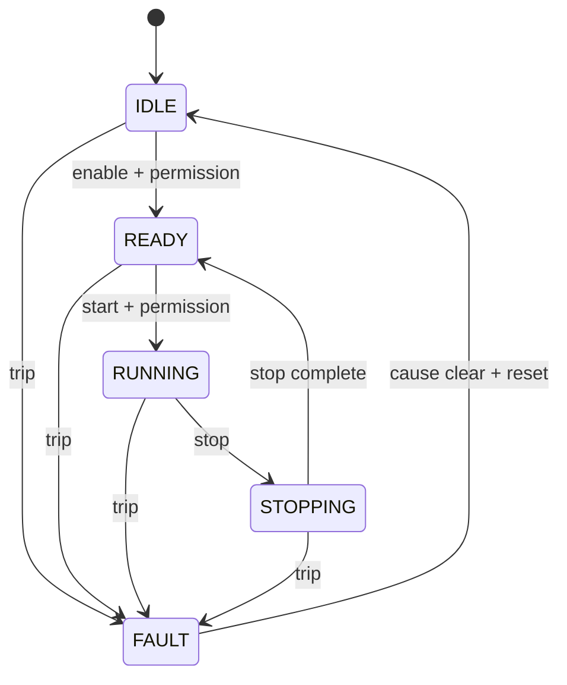

# Week 05 — Equipment States, Modes, and Commands

> **Guiding question:** How should software represent what a machine is doing and what it is allowed to do?

## Learning objectives

- Separate state, mode, command, status, and fault.
- Build explicit transitions.
- Prevent invalid automatic restart.
- Design observable transition rejection.

## Key terms

| Term | Working meaning |
| --- | --- |
| **State** | Current lifecycle condition. |
| **Mode** | Operating policy such as manual or automatic. |
| **Command** | Request for a transition or action. |
| **Transition** | Allowed movement between states. |
| **Guard condition** | Condition required for a transition. |
| **Recovery** | Controlled path from abnormal state to a known state. |

## Mental model

## State versus mode

State answers: **What is the equipment doing?**

Mode answers: **Which commands and behaviors are permitted?**

Examples:

- state: `READY`
- mode: `MANUAL`
- command: `JOG_POSITIVE`

Do not encode mode into every state name.

## Transition contract

Each transition should define:

- source state
- command or event
- guard conditions
- target state
- side effects
- rejection reason
- timeout behavior

## Command lifecycle

For long actions, expose:

- accepted
- busy
- done
- aborted
- error
- reason

A one-scan `start` does not mean the action finished.

## Restart policy

After a fault:

1. stop or remove command authority
2. latch fault
3. clear physical cause
4. request reset
5. return to known non-running state
6. require a new start command

## Worked example

State is `FAULT`. Guard is closed again.

Bad behavior: machine returns directly to `RUNNING` because the old start bit is still true.

Good behavior: reset returns to `IDLE`; a new enable and start sequence is required.

## Common mistakes

- State explosion caused by combining mode and state.
- Silent rejection of commands.
- Automatic restart after reset.
- Allowing every state to transition to every other state.

## Practice

1. Create a transition table for IDLE/READY/RUNNING/STOPPING/FAULT.
2. Add rejection reasons for invalid start.
3. Define manual mode without duplicating all states.

## Practical lab

[Lab 03 — Equipment state](../labs/lab-03-machine-state.md)

## Knowledge checks

1. **What is the difference between state and mode?**

   

Answer

   State is current lifecycle behavior; mode selects allowed operating policy.

   

2. **Why return to IDLE after reset?**

   

Answer

   It creates a known non-running condition and prevents automatic restart.

   

3. **What should happen to an invalid command?**

   

Answer

   Reject it and expose a reason.

   

4. **Why use a transition table?**

   

Answer

   It makes allowed paths, guards, and rejected paths reviewable.

   

## Deep study

- [PLCopen Motion Control](https://www.plcopen.org/standards/motion-control/) — Observe standardized state and function-block lifecycle ideas.
- [Structured Text state example](../examples/structured-text/FB_EquipmentStateMachine.st) — Trace the repository implementation.

## Exit criteria

Move on when you can:

- explain the guiding question without notes
- reproduce the worked example
- pass the knowledge checks
- complete the linked evidence
- state one limitation of the model
