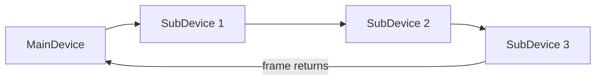

# Week 08 — EtherCAT States and Diagnostics

> **Guiding question:** How does EtherCAT exchange process data and expose communication faults?

## Learning objectives

- Explain on-the-fly frame processing.
- Describe common network states.
- Explain working-counter purpose.
- Use topology and counter evidence during diagnosis.

## Key terms

| Term | Working meaning |
| --- | --- |
| **MainDevice** | Controller that initiates EtherCAT frames. |
| **SubDevice** | Device that processes addressed data in the moving frame. |
| **Datagram** | EtherCAT operation within a frame. |
| **Working counter** | Count indicating successful addressed processing. |
| **Distributed clocks** | Hardware clock synchronization mechanism. |
| **CoE** | CAN application protocol over EtherCAT. |

## Mental model



SubDevices read and insert data while the frame passes.

## Core principle

- MainDevice sends the frame.
- Each addressed SubDevice processes its data in hardware.
- One frame can carry several datagrams.
- Logical addressing maps process-image regions.
- Acyclic mailbox protocols carry configuration and diagnostics.

## State intuition

Common progression:

```text
INIT → PRE-OP → SAFE-OP → OP
```

Simplified meaning:

- `INIT`: basic initialization
- `PRE-OP`: mailbox/configuration available
- `SAFE-OP`: inputs may be valid; outputs restricted
- `OP`: configured process data active

Use current vendor documentation for exact transition rules.

## Working counter

Each successfully addressed device increments the datagram working counter as defined by the access.

Unexpected value can indicate:

- missing device
- state mismatch
- inaccessible memory
- mapping/configuration problem

It does not directly identify every root cause.

## Distributed clocks

Purpose:

- aligned local device time
- precise input sampling
- coordinated output timing
- reduced effect of frame-arrival jitter

Clock synchronization does not automatically make application code deterministic.

## Diagnostic sequence

1. Compare planned and actual topology.
2. Check device states.
3. Check link and error counters.
4. Check expected working counters.
5. Check process mapping.
6. Check drive/device profile state.
7. Check application logic.

## Worked example

Expected working counter: `6`.

Observed: `4`.

Do not immediately replace a cable.

Check:

- which datagram failed
- which devices should increment it
- device state
- mapping access
- link/error counters near the failure point

## Common mistakes

- Treating EtherCAT as ordinary switched Ethernet.
- Using working counter as the only diagnostic.
- Confusing distributed-clock sync with control-loop completion.
- Assuming all SubDevices support the same mailbox profiles.

## Practice

1. Draw a three-device line topology.
2. Explain SAFE-OP versus OP in your own words.
3. Create a working-counter fault checklist.

## Practical lab

Design and diagnostic exercise. The code does not implement an EtherCAT master.

## Knowledge checks

1. **Who initiates EtherCAT frames?**

   <details><summary>Answer</summary>

   The MainDevice.

   </details>

2. **What does an unexpected working counter indicate?**

   <details><summary>Answer</summary>

   Expected addressed processing did not occur; investigate state, mapping, device presence, and access.

   </details>

3. **What do distributed clocks improve?**

   <details><summary>Answer</summary>

   Synchronization of local sampling and output timing.

   </details>

4. **Does this repository implement EtherCAT?**

   <details><summary>Answer</summary>

   No. It teaches concepts and troubleshooting layers.

   </details>

## Deep study

- [EtherCAT Technology Overview](https://www.ethercat.org/en/technology.html) — Primary overview. Focus on functional principle, clocks, and diagnosis.
- [EtherCAT Diagnosis for Users](https://www.ethercat.org/en/technology.html#1.6) — Use the current ETG diagnosis material when available.
- [Beckhoff EtherCAT documentation](https://infosys.beckhoff.com/content/1033/ethercatsystem/index.html) — Vendor-specific implementation and diagnosis detail.

## Exit criteria

Move on when you can:

- explain the guiding question without notes
- reproduce the worked example
- pass the knowledge checks
- complete the linked evidence
- state one limitation of the model
