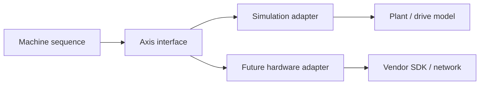

# Week 12 — Controller Interfaces, Hardware Abstraction, and Simulation

> **Guiding question:** How can control logic be tested without hard-coding a vendor or device?

## Learning objectives

- Define a narrow axis or I/O interface.
- Use dependency inversion and test doubles.
- Separate desired command from observed hardware status.
- Design a simulation/hardware boundary.

## Key terms

| Term | Working meaning |
| --- | --- |
| **Interface** | Contract describing operations and data. |
| **Adapter** | Implementation that connects a contract to a specific system. |
| **Test double** | Replacement used to control behavior in tests. |
| **Dependency inversion** | High-level logic depends on contracts, not concrete hardware. |
| **Simulation boundary** | Explicit point where modeled behavior replaces physical behavior. |

## Mental model

## Good interface shape

A small axis contract may expose:

- command target
- enable request
- stop request
- position and velocity
- state and fault
- freshness
- update method

Avoid exposing every vendor object to the application.

## Command/status separation

Command object:

- target
- limits
- request identifier
- deadline or timeout

Status object:

- accepted/busy/done/error
- position and velocity
- state
- fault and diagnostic
- sample timestamp

## Test doubles

Use a fake or simulator to create:

- normal move
- slow move
- stale feedback
- communication loss
- drive fault
- impossible configuration
- stuck position

## Boundary honesty

A simulator can test:

- application state
- command lifecycle
- validation
- diagnostics

It does not prove:

- electrical compatibility
- device timing
- fieldbus conformance
- mechanical performance
- safety integrity

## Worked example

A sequence calls `axis.move(target=100 mm)`.

Simulation adapter reaches target after 200 updates.

Fault adapter accepts command but freezes measurement.

The sequence should timeout and report `axis_no_progress`, without knowing the vendor API.

## Common mistakes

- Returning only raw vendor status bits.
- Making the simulator always succeed.
- Putting network calls inside domain logic.
- Claiming hardware readiness because mocks pass.

## Practice

1. Design an `AxisStatus` data structure.
2. Write a fake that produces stale feedback.
3. List what belongs in adapter versus sequence logic.

## Practical lab

Extend the motion lab with an interface and two test doubles.

## Knowledge checks

1. **Why depend on an interface?**

   

Answer

   It keeps domain logic testable and reduces vendor coupling.

   

2. **What should a failure simulator do?**

   

Answer

   Produce realistic observable failures, not only exceptions.

   

3. **What does a passing simulation prove?**

   

Answer

   The tested software behavior under the model assumptions.

   

4. **Where should vendor conversion live?**

   

Answer

   In the hardware adapter.

   

## Deep study

- [Python typing protocols](https://docs.python.org/3/library/typing.html#typing.Protocol) — Use structural interfaces for testable boundaries.
- [Python `unittest.mock`](https://docs.python.org/3/library/unittest.mock.html) — Build controllable hardware test doubles.
- [Capstone handoff](../docs/07-future-capstone-handoff.md) — Review the simulation/hardware adapter contract.

## Exit criteria

Move on when you can:

- explain the guiding question without notes
- reproduce the worked example
- pass the knowledge checks
- complete the linked evidence
- state one limitation of the model
