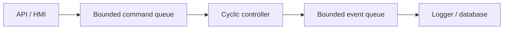

# Week 13 — Concurrency, Bounded Queues, Configuration, and Logging

> **Guiding question:** How can controller software interact with slower services without losing predictable behavior?

## Learning objectives

- Separate cyclic and service responsibilities.
- Define bounded queue policies.
- Validate configuration before activation.
- Design logging that does not block control.

## Key terms

| Term | Working meaning |
| --- | --- |
| **Bounded queue** | Queue with fixed capacity. |
| **Backpressure** | Mechanism that limits producers when consumers are slower. |
| **Stale command** | Command too old for safe or correct use. |
| **Configuration snapshot** | Validated immutable settings used by a running cycle. |
| **Structured log** | Machine-readable event with stable fields. |
| **Correlation ID** | Identifier linking command, events, and results. |

## Mental model



The controller never waits for the database.

## Queue policies

When full, choose explicitly:

- reject newest
- drop oldest
- replace by key
- block producer outside cyclic path
- enter degraded/fault state

Never allow silent unbounded growth.

## Stale data

A command should include:

- creation time
- source
- sequence or ID
- expiry or max age

Reject commands that are valid in shape but too old.

## Configuration

Validate before use:

- units
- ranges
- relationships
- version
- hardware compatibility
- required fields

Activate an immutable snapshot at a controlled boundary.

## Logging

Good control event:

```json
{
  "event": "motion_blocked",
  "axis": "x",
  "reason": "guard_open",
  "state": "READY",
  "command_id": "cmd-42"
}
```

Avoid formatted prose as the only diagnostic.

## Concurrency hazards

Watch for:

- races
- partial updates
- priority inversion
- unbounded locks
- blocking I/O
- shared mutable configuration

## Worked example

HMI sends 200 jog commands per second. Controller consumes 100.

Unbounded queue: latency grows until commands are dangerous and stale.

Bounded policy: keep the latest jog intent per axis, reject expired requests, and report overflow count.

## Common mistakes

- Using an unbounded queue.
- Reloading configuration mid-calculation.
- Logging synchronously to disk in the cyclic task.
- Ignoring command age.

## Practice

1. Choose a queue policy for setpoints versus alarms.
2. Define configuration validation for velocity and acceleration.
3. Create a structured timeout event.

## Practical lab

Architecture exercise. Add queue-overflow and stale-command tests.

## Knowledge checks

1. **Why bound a queue?**

   <details><summary>Answer</summary>

   To bound memory and latency and make overload behavior explicit.

   </details>

2. **Why use immutable configuration in the cycle?**

   <details><summary>Answer</summary>

   It prevents partial changes during an update.

   </details>

3. **Where should file or database logging run?**

   <details><summary>Answer</summary>

   Outside the critical cyclic path.

   </details>

4. **How should overload be observed?**

   <details><summary>Answer</summary>

   Counters, events, rejection reasons, and health state.

   </details>

## Deep study

- [ROS 2 real-time background](https://design.ros2.org/articles/realtime_background.html) — Read memory, I/O, and synchronization guidance.
- [Python queue documentation](https://docs.python.org/3/library/queue.html) — Study bounded queue behavior; note that general Python queues are not hard real-time primitives.
- [Python logging cookbook](https://docs.python.org/3/howto/logging-cookbook.html) — Use queue-based logging patterns outside the critical path.

## Exit criteria

Move on when you can:

- explain the guiding question without notes
- reproduce the worked example
- pass the knowledge checks
- complete the linked evidence
- state one limitation of the model
