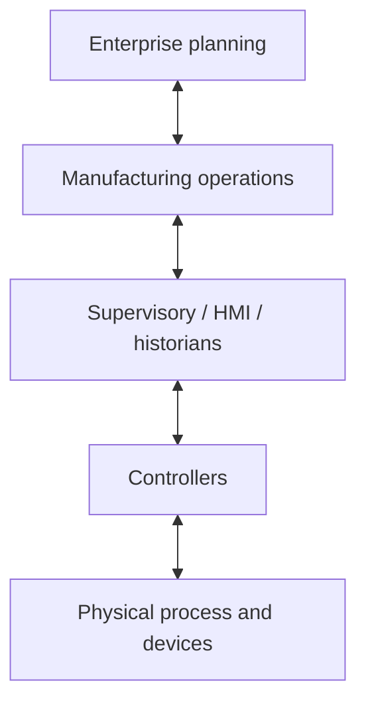

# Week 14 — Factory Information Layers and OT/IT Boundaries

> **Guiding question:** Where should machine data, operations data, and enterprise data live?

## Learning objectives

- Map field, control, supervisory, operations, and enterprise responsibilities.
- Explain OT/IT trust and ownership boundaries.
- Separate current state from historical events.
- Avoid direct enterprise control of field outputs.

## Key terms

| Term | Working meaning |
| --- | --- |
| **OT** | Technology that monitors or changes physical processes. |
| **IT** | Enterprise computing and information services. |
| **MES/MOM** | Manufacturing operations coordination. |
| **SCADA/HMI** | Supervisory monitoring and operator interaction. |
| **Asset** | Identified equipment or resource. |
| **Work order** | Authorized production request. |

## Mental model

## Responsibility split

| Layer | Owns |
| --- | --- |
| Field/control | immediate safe standard-control behavior |
| Supervisory | operator view, alarms, trends, recipes |
| Operations | schedules, work execution, genealogy, quality |
| Enterprise | demand, inventory, finance, planning |

## Command authority

Enterprise request should become a validated production intent.

Do not let an ERP field directly write a motor command.

Insert:

- authorization
- recipe validation
- machine availability
- state transition
- acknowledgement and result

## Current state versus event

Current state answers: **What is true now?**

Event answers: **What happened?**

Example:

- current: `machine_state=RUNNING`
- event: `cycle_started at 10:42:13 for part P-19`

## Trust boundaries

For every connection define:

- identity
- permitted operations
- data direction
- network zone
- update rate
- retry behavior
- audit trail
- failure behavior

## Worked example

ERP releases work order `WO-55`.

MES validates product and quantity.

Machine receives a recipe identifier, not arbitrary actuator values.

Controller validates local state and loaded recipe before start.

## Common mistakes

- Using one database as the live controller state.
- Allowing high-level systems to bypass local validation.
- Confusing historian data with authoritative command state.
- Ignoring ownership of identifiers.

## Practice

1. Map a small packaging line to five layers.
2. Define data flowing up and commands flowing down.
3. Mark two trust boundaries.

## Practical lab

Create the manufacturing information-flow diagram.

## Knowledge checks

1. **Why should enterprise software not command actuators directly?**

   

Answer

   It lacks the local timing, state, validation, and safety context.

   

2. **What is the difference between current state and event?**

   

Answer

   State is the latest condition; an event is an immutable occurrence.

   

3. **What crosses a trust boundary?**

   

Answer

   Authenticated, authorized, validated data with defined direction and failure behavior.

   

4. **Who should own immediate machine behavior?**

   

Answer

   The local control layer.

   

## Deep study

- [NIST SP 800-82 Rev. 3](https://csrc.nist.gov/pubs/sp/800/82/r3/final) — Study OT architecture, zones, threats, and operational constraints.
- [ISA-95 Part 1 product page](https://www.isa.org/products/ansi-isa-95-00-01-2010-iec-62264-1-mod-enterprise) — Use the standard overview; the full standard may require purchase.
- [OPC Foundation UA overview](https://opcfoundation.org/about/opc-technologies/opc-ua/) — Preview information modeling across layers.

## Exit criteria

Move on when you can:

- explain the guiding question without notes
- reproduce the worked example
- pass the knowledge checks
- complete the linked evidence
- state one limitation of the model
