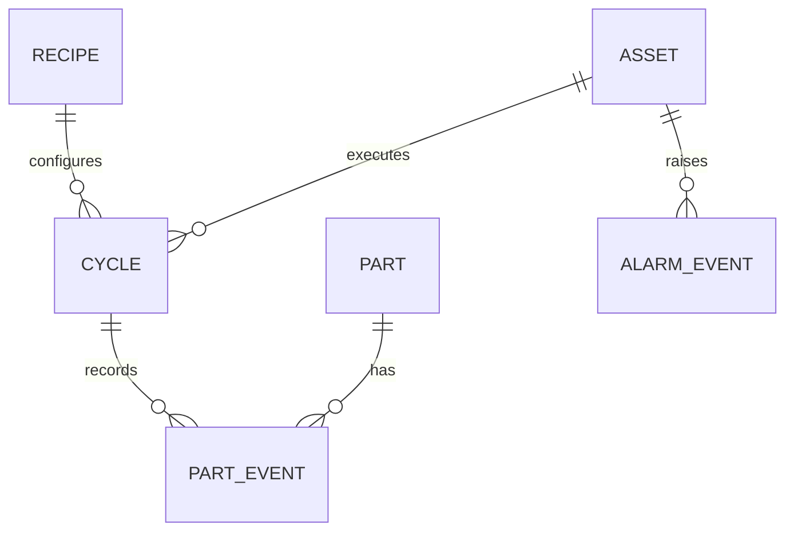

# Week 16 — SQL, Traceability, and Production Data Models

> **Guiding question:** How can a system reconstruct what happened to one part?

## Learning objectives

- Model assets, parts, recipes, cycles, alarms, and events.
- Use keys and constraints for traceability.
- Separate event history from current projections.
- Write basic genealogy queries.

## Key terms

| Term | Working meaning |
| --- | --- |
| **Primary key** | Unique row identity. |
| **Foreign key** | Relationship constraint to another row. |
| **Event ID** | Stable identity used for deduplication. |
| **Genealogy** | Reconstructed history and relationships of a part or batch. |
| **Projection** | Derived current state built from events. |
| **Index** | Data structure that accelerates selected queries. |

## Mental model

## Core entities

Minimum useful model:

- `asset`
- `recipe`
- `work_order`
- `cycle`
- `part`
- `part_event`
- `alarm_event`
- `measurement`

## Event fields

A part event should usually include:

- event ID
- part ID
- event type
- event time
- source time and receive time when needed
- asset or station
- cycle ID
- sequence or ordering rule
- payload/schema version

## Constraints

Use database constraints for:

- unique event ID
- valid foreign keys
- non-negative counts
- required timestamps
- allowed status values where practical

Do not rely only on application validation.

## Indexes

Index from real query needs:

- part history by `(part_id, event_time)`
- cycle events by `cycle_id`
- alarm history by `(asset_id, active_time)`
- deduplication by unique `event_id`

Every index adds write cost.

## Late and duplicate data

Define:

- duplicate key policy
- late event handling
- clock source
- correction event model
- immutable audit rules
- retention and archival

## Worked example

Question: “Which recipe and station processed part P-104?”

Query joins:

- `part`
- `part_event`
- `cycle`
- `recipe`
- `asset`

Order by event sequence/time. Keep raw event IDs for audit.

## Common mistakes

- Using timestamps as the only unique key.
- Updating history rows instead of recording correction.
- Storing all data in one JSON column without query plan.
- Creating indexes without query evidence.

## Practice

1. Run the example schema.
2. Write a part-history query.
3. Add a unique event constraint.
4. Define a late-event policy.

## Practical lab

[Lab 06 — Manufacturing data](../labs/lab-06-manufacturing-data.md) and [`examples/sql/manufacturing-schema.sql`](../examples/sql/manufacturing-schema.sql).

## Knowledge checks

1. **Why use a stable event ID?**

   

Answer

   To detect retries and duplicates independently of timestamps.

   

2. **What is genealogy?**

   

Answer

   The ordered production history and relationships for a part or batch.

   

3. **Why keep events immutable?**

   

Answer

   They support auditability and reconstruction.

   

4. **Why not index every column?**

   

Answer

   Indexes consume storage and slow writes; choose them for actual queries.

   

## Deep study

- [PostgreSQL tutorial](https://www.postgresql.org/docs/current/tutorial.html) — Learn tables, joins, aggregates, and transactions.
- [PostgreSQL constraints](https://www.postgresql.org/docs/current/ddl-constraints.html) — Study primary, unique, check, and foreign-key constraints.
- [PostgreSQL indexes](https://www.postgresql.org/docs/current/indexes.html) — Use after defining query patterns.

## Exit criteria

Move on when you can:

- explain the guiding question without notes
- reproduce the worked example
- pass the knowledge checks
- complete the linked evidence
- state one limitation of the model
